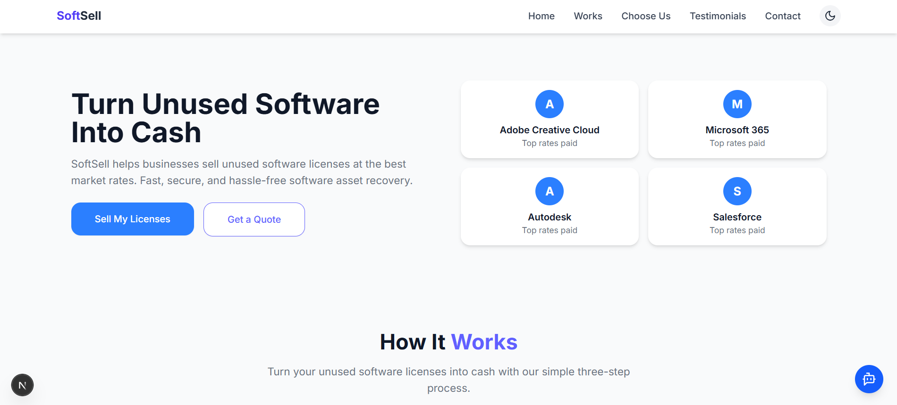

# 📑 SoftSell – Software License Resale Marketing Website

A responsive, one-page marketing website for a fictional software resale startup called **SoftSell**.

SoftSell helps users turn their unused software licenses into cash quickly and securely. Built with modern web technologies and responsive design principles.

---

## 🚀 Live Demo

🔗 [Visit SoftSell on Vercel](https://soft-sell-rho.vercel.app/)


---

## 🛠 Tech Stack

- **Framework**: [Next.js](https://nextjs.org/) (Typescript)
- **Styling**: [Tailwind CSS](https://tailwindcss.com/)
- **UI Components**: [shadcn/ui](https://ui.shadcn.com/)
- **Animations**: [Framer Motion](https://www.framer.com/motion/)
- **Hosting**: [Vercel](https://vercel.com/)

---

## 📸 Preview



---

## 📦 Features Implemented

### ✅ Layout & Design

- Responsive, single-page layout
- Consistent spacing, color palette, and font hierarchy
- Mobile-first design

### ✅ Components & Sections

- **Navbar**: Simple navigation bar with brand name
- **Hero Section**: Animated headline, subheading, and CTA button using Framer Motion
- **How It Works**: Three-step process (Upload License → Get Valuation → Get Paid) with icons
- **Why Choose Us**: 4 benefits with icons and short descriptions
- **Customer Testimonials**: 2 dummy reviews with name, role, and company
- **Contact / Lead Form**: Form with Name, Email, Company, License Type (dropdown), Message — frontend validation only
- **Footer**: Clean and minimal footer with copyright

### ✅ UI/UX Enhancements

- Light/Dark mode toggle using `shadcn/ui` theme system
- Smooth animations on scroll and load using Framer Motion
- Semantic HTML for accessibility and SEO

---

## ⏱ Time Spent

| Task                        | Time        |
|-----------------------------|-------------|
| Project Completed           | 36 Hours    |

## 🧪 To Run Locally

```bash
git clone 
cd softsell
npm install
npm run dev


